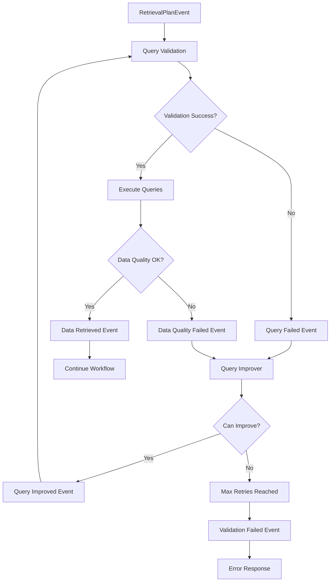

# Design Document

## Overview

This design implements an intelligent SQL query validation and retry system for the LlamaIndex workflow. The system uses event-driven loops to validate queries, execute them safely, and automatically retry with improved queries when failures occur. The design follows the LlamaIndex workflow pattern with custom events to create validation and retry loops.

## Architecture

### Core Components

1. **Query Validation Loop**: Validates SQL queries before execution using schema analysis
2. **Retry Management System**: Controls retry attempts and prevents infinite loops
3. **Query Improvement Engine**: Generates better queries based on failure analysis
4. **Data Quality Validation**: Validates retrieved data meets expected criteria
5. **Schema Analysis Service**: Provides deep schema understanding for validation

### Event Flow Architecture



## Components and Interfaces

### 1. Enhanced Event System

```python
class QueryValidationEvent(Event):
    """Event for query validation step."""
    query: str
    analysis: Any
    format_info: Any
    plan: RetrievalPlan
    retry_count: int = 0

class QueryFailedEvent(Event):
    """Event when query validation or execution fails."""
    original_plan: RetrievalPlan
    error_details: Dict[str, Any]
    retry_count: int
    failure_type: str  # "validation", "execution", "data_quality"

class QueryImprovedEvent(Event):
    """Event when query has been improved."""
    improved_plan: RetrievalPlan
    improvement_reasoning: str
    retry_count: int

class ValidationFailedEvent(Event):
    """Event when max retries reached or improvement impossible."""
    final_error: str
    retry_history: List[Dict[str, Any]]

class DataQualityFailedEvent(Event):
    """Event when data quality validation fails."""
    retrieved_data: Dict[str, Any]
    quality_issues: List[str]
    original_plan: RetrievalPlan
    retry_count: int
```

### 2. Query Validator Service

```python
class QueryValidator:
    """Validates SQL queries against database schemas."""
    
    def __init__(self, db_session: Session, table_schemas: Dict[str, Any]):
        self.db_session = db_session
        self.table_schemas = table_schemas
        self.schema_analyzer = SchemaAnalyzer(table_schemas)
    
    async def validate_query_plan(self, plan: RetrievalPlan) -> ValidationResult:
        """Validate all queries in the retrieval plan."""
        
    async def validate_syntax(self, query: str) -> bool:
        """Validate SQL syntax without execution."""
        
    async def validate_schema_compliance(self, query: str) -> SchemaValidationResult:
        """Validate query against database schema."""
        
    async def check_performance_risks(self, query: str) -> List[str]:
        """Identify potential performance issues."""
```

### 3. Query Improver Agent

```python
class QueryImprover:
    """Improves failed SQL queries based on error analysis."""
    
    async def improve_query_plan(
        self, 
        failed_plan: RetrievalPlan,
        error_details: Dict[str, Any],
        schema_info: Dict[str, Any]
    ) -> Optional[RetrievalPlan]:
        """Generate improved query plan based on failure analysis."""
        
    async def analyze_failure_cause(self, error_details: Dict[str, Any]) -> str:
        """Analyze why the query failed."""
        
    async def suggest_schema_corrections(self, query: str, schema_error: str) -> str:
        """Suggest corrections for schema-related errors."""
```

### 4. Data Quality Checker

```python
class DataQualityChecker:
    """Validates quality of retrieved data."""
    
    async def validate_data_quality(
        self, 
        retrieved_data: Dict[str, Any],
        expected_types: List[str],
        query_context: str
    ) -> DataQualityResult:
        """Validate retrieved data meets quality criteria."""
        
    async def check_data_completeness(self, data: Dict[str, Any]) -> bool:
        """Check if data is complete and non-empty."""
        
    async def validate_data_types(self, data: Dict[str, Any], expected_types: List[str]) -> bool:
        """Validate data types match expectations."""
```

### 5. Enhanced Workflow Steps

The workflow will be modified to include validation and retry loops:

```python
@step
async def validate_and_execute_queries(
    self, ctx: Context, ev: RetrievalPlanEvent | QueryImprovedEvent
) -> DataRetrievedEvent | QueryFailedEvent:
    """Validate queries and execute if valid."""
    
@step
async def improve_failed_query(
    self, ctx: Context, ev: QueryFailedEvent | DataQualityFailedEvent
) -> QueryImprovedEvent | ValidationFailedEvent:
    """Improve failed queries or terminate if max retries reached."""
    
@step
async def validate_data_quality(
    self, ctx: Context, ev: DataRetrievedEvent
) -> DataRetrievedEvent | DataQualityFailedEvent:
    """Validate quality of retrieved data."""
```

## Data Models

### Enhanced RetrievalPlan

```python
class EnhancedRetrievalPlan(BaseModel):
    """Enhanced retrieval plan with validation metadata."""
    sql_queries: List[SQLQuery]
    reasoning: str
    expected_data_types: List[str]
    validation_metadata: Dict[str, Any] = {}
    retry_count: int = 0
    improvement_history: List[str] = []
```

### Validation Results

```python
class ValidationResult(BaseModel):
    """Result of query validation."""
    is_valid: bool
    syntax_errors: List[str] = []
    schema_errors: List[str] = []
    performance_warnings: List[str] = []
    suggestions: List[str] = []

class DataQualityResult(BaseModel):
    """Result of data quality validation."""
    is_valid: bool
    completeness_score: float
    type_compliance: bool
    quality_issues: List[str] = []
    suggestions: List[str] = []
```

## Error Handling

### Retry Strategy

1. **Maximum Retry Limit**: Default 3 attempts per query plan
2. **Exponential Backoff**: Optional delay between retries
3. **Failure Classification**: Different strategies for different failure types
4. **Graceful Degradation**: Return partial results when possible

### Error Types

1. **Syntax Errors**: Invalid SQL syntax
2. **Schema Errors**: Non-existent tables/columns, invalid joins
3. **Execution Errors**: Runtime database errors
4. **Data Quality Errors**: Empty results, type mismatches
5. **Performance Errors**: Queries that may cause timeouts

## Testing Strategy

### Unit Tests

1. **Query Validator Tests**: Test syntax and schema validation
2. **Query Improver Tests**: Test improvement logic with various error types
3. **Data Quality Tests**: Test data validation with different data scenarios
4. **Retry Logic Tests**: Test retry limits and loop prevention

### Integration Tests

1. **End-to-End Validation Flow**: Test complete validation and retry cycle
2. **Database Integration**: Test with real database schemas and data
3. **Performance Tests**: Test validation performance with large schemas
4. **Error Recovery Tests**: Test recovery from various failure scenarios

### Test Data

1. **Valid Query Plans**: Plans that should pass validation
2. **Invalid Query Plans**: Plans with various types of errors
3. **Schema Fixtures**: Test database schemas for validation
4. **Mock Data**: Controlled data for quality validation tests

## Configuration

### Validation Settings

```python
class ValidationConfig(BaseModel):
    max_retries: int = 3
    enable_syntax_validation: bool = True
    enable_schema_validation: bool = True
    enable_performance_checks: bool = True
    enable_data_quality_checks: bool = True
    retry_delay_seconds: float = 1.0
    performance_timeout_seconds: int = 30
```

### Quality Thresholds

```python
class QualityThresholds(BaseModel):
    min_result_rows: int = 1
    max_result_rows: int = 10000
    required_completeness_score: float = 0.8
    allow_empty_results: bool = False
```